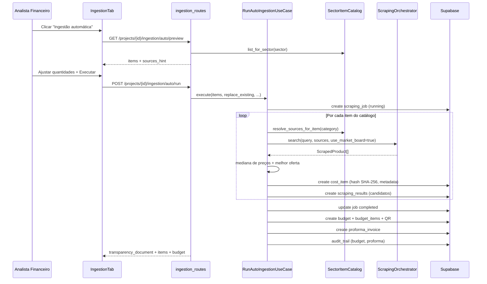

# Módulo de Ingestão Automática de Dados — ViabilizA+ África

Documento técnico-funcional que descreve o **Módulo 3 — Ingestão de Dados (Rastreável)**, com foco na **ingestão automática**: evolução desde a conceção inicial até às funcionalidades mais recentes.

---

## 1. Visão geral

O módulo permite ao **Analista Financeiro** popular um projeto de viabilidade com itens OPEX/CAPEX **com origem verificável**, reduzindo trabalho manual e aumentando a confiança de investidores, bancos e auditores.

A ingestão automática é o fluxo mais completo: o sistema consulta o catálogo setorial do projeto, pesquisa preços no mercado angolano, cria os itens de custo com hash SHA-256, gera orçamento rastreável com QR Code, fatura proforma e documento de transparência — tudo numa única operação iniciada pelo utilizador.

Além da ingestão automática, o módulo inclui modos complementares:

| Modo | Caso de uso | Descrição |
|------|-------------|-----------|
| **Ingestão automática** | Pipeline completo | Catálogo setorial → preços → `cost_items` → orçamento → proforma → transparência |
| **Scraping pontual** | UC14–UC15 | Pesquisa manual por termo; o analista escolhe a oferta |
| **Importação manual** | UC12 | Item a item, com lookup de NIF na AGT |
| **Importação Excel** | UC13 | Até 1000 linhas, cada uma com hash |
| **Orçamento rastreável** | UC16–UC17 | Hash em cadeia + QR Code para verificação pública |
| **Audit trail** | UC18 | Registo imutável de ações sensíveis |

---

## 2. User story

### Histórias de utilizador (README)

| ID | Perfil | História |
|----|--------|----------|
| **H06** | Analista Financeiro | Importar itens OPEX/CAPEX via Excel para não perder tempo a digitar item por item |
| **H07** | Analista Financeiro | Executar scraping automático de preços de fornecedores para que os valores sejam reais e atualizados do mercado africano |
| **H08** | Analista Financeiro | Que cada dado importado tenha um hash SHA-256 registado para que investidores e auditores confiem na origem dos números |
| **H11** | Analista Financeiro | Gerar um orçamento rastreável com QR Code para que o banco possa verificar a autenticidade dos dados em tempo real |

### Casos de uso mapeados

| ID | Nome | Actor |
|----|------|-------|
| UC12 | Importar dados manualmente | Analista Financeiro |
| UC13 | Importar dados via Excel | Analista Financeiro |
| UC14 | Executar scraping automático | Analista Financeiro |
| UC15 | Selecionar fornecedor | Analista Financeiro |
| UC16 | Gerar orçamento rastreável | Analista Financeiro |
| UC17 | Gerar fatura proforma | Analista Financeiro |
| UC18 | Visualizar audit trail | Analista / Admin |
| UC35 | Configurar APIs de mercado | Administrador |

### User story da ingestão automática (síntese)

> **Como** Analista Financeiro,  
> **quero** executar uma ingestão automática a partir do setor do meu projeto,  
> **para que** o sistema preencha os custos OPEX/CAPEX com preços reais do mercado angolano, documente a fonte de cada valor, gere um orçamento verificável com QR Code e uma fatura proforma,  
> **sem** ter de pesquisar manualmente dezenas de itens em múltiplos fornecedores.

**Critérios de aceitação implícitos no código:**

1. Pré-visualizar o catálogo setorial antes de executar
2. Ajustar quantidades e seleccionar quais itens incluir
3. Consultar fontes credíveis por categoria de item
4. Registar preço, fornecedor, URL e método de selecção por linha
5. Gerar hashes SHA-256 em cada item e no orçamento
6. Devolver documento de transparência com totais CAPEX/OPEX
7. Registar acções no audit trail

**Permissões:** apenas `admin` e `financial` (proprietário do projeto) podem ingerir dados. Utilizadores comuns (`user`) visualizam apenas.

---

## 3. Evolução do módulo (do princípio às últimas funcionalidades)

### Fase 1 — Fundação (migration `003_module3_ingestion.sql`)

Estabeleceu o modelo de dados rastreável:

- **`cost_items`** — itens OPEX/CAPEX com `source` (`manual`, `excel`, `scraping`), `data_hash`, metadados JSONB
- **`scraping_jobs`** — registo de execuções de pesquisa
- **`scraping_results`** — ofertas encontradas (preço, URL, hash)
- **`budgets`** / **`budget_items`** — orçamento com `verification_hash` e QR Code
- **`proforma_invoices`** — faturas proforma
- **`audit_trail`** — log imutável (trigger impede UPDATE/DELETE)
- **`scraping_sources`** — fontes configuráveis

Scraping inicial limitado a **Jumia** e **Jiji**.

### Fase 2 — Rastreabilidade de fornecedores (`011`, `012`)

- Coluna **`supplier_nif`** em `cost_items` para identificação fiscal (lookup AGT na importação manual)
- Garantia de schema UUID consistente

### Fase 3 — Expansão de marketplaces (`013_auto_ingestion_sources.sql`)

Adicionadas fontes angolanas além de Jumia/Jiji:

- **Kikolo Online**
- **Socia.ao**
- **Facebook Marketplace**
- **Praça Digital**

Introduziu o pipeline de **ingestão automática** com catálogo setorial (`SectorItemCatalog`) e use cases `PreviewAutoIngestionUseCase` / `RunAutoIngestionUseCase`.

### Fase 4 — Retalho angolano por categoria (`014_angolan_retail_sources.sql`)

Grande expansão: **~60+ retalhistas** angolanos com:

- `categories[]` — mapeamento por tipo de item (construção, IT, eléctrico, etc.)
- `scrape_enabled` — flag de scraping HTML activo
- `city_note` — localização
- Código alargado para `VARCHAR(50)`

Exemplos: Maxi, Shoprite, Bricomat, Ovarmat, Intercal, Siluz, Soletric, NCR, SISTEC, Megatech, Casa PCs, Moviflor, Toyota AO, Agrolíder, entre outros.

Implementação de **`GenericHtmlMarketplaceScraper`** para lojas com pesquisa HTML e **`resolve_sources_for_item()`** para encaminhar cada categoria às fontes mais relevantes.

### Fase 5 — Refinamentos IT (`015_ncr_sistec_sources.sql`)

Actualização de metadados das lojas **NCR** e **SISTEC** (sector IT/electrodomésticos).

### Fase 6 — Música e áudio (`016_music_retail_sources.sql`) — **última funcionalidade**

Integração do sector musical no ecossistema de fontes:

| Código | Nome | Scraping activo |
|--------|------|-----------------|
| `gudesom` | GudeSom Angola | **Sim** |
| `iscotec_music` | Iscotec Music | Não |
| `vens_music` | VENS Music | Não |
| `musicomania` | Musicomania | Não |
| `king_kong_music` | King Kong Music | Não |
| `casa_musica_ao` | Casa da Música Angola | Não |

**GudeSom** está em `FAST_SOURCES` do orquestrador (prioridade nas ondas locais). As restantes lojas servem como referência/contacto até terem URLs de pesquisa no domínio.

No catálogo setorial, o item `ot_som` (*"Instrumentos / som"*) usa query `guitarra teclado mesa de som`. A **tabela de mercado** (`angolan_market_price_board`) inclui preços de referência para instrumentos, PA, DJ e iluminação atribuídos a GudeSom.

Categorias **Áudio**, **Ambientação** e **Eventos** mapeiam para o grupo `music` em `CATALOG_CATEGORY_TO_GROUPS`.

---

## 4. Arquitetura

### 4.1 Camadas (Clean Architecture)

```
Frontend (IngestionTab + ingestion-api.ts)
    ↓
Presentation (ingestion_routes.py, admin_routes.py)
    ↓
Application (use cases: auto_ingestion, scraping, cost_items, budgets, audit_trail)
    ↓
Domain (SectorItemCatalog, angolan_retail_suppliers, angolan_market_price_board, enums, repositórios)
    ↓
Infrastructure (ScrapingOrchestrator, scrapers, Supabase repositories, Sha256HashService, QRCodeService)
```

### 4.2 Ficheiros principais

| Camada | Ficheiro | Responsabilidade |
|--------|----------|------------------|
| API | `backend/app/presentation/api/v1/ingestion_routes.py` | Endpoints REST do módulo 3 |
| API Admin | `backend/app/presentation/api/v1/admin_routes.py` | CRUD de `scraping_sources` (UC35) |
| Auto-ingestão | `backend/app/application/use_cases/ingestion/auto_ingestion.py` | Preview + Run pipeline |
| Scraping manual | `backend/app/application/use_cases/ingestion/scraping.py` | UC14–UC15 |
| Cost items | `backend/app/application/use_cases/ingestion/cost_items.py` | UC12–UC13 |
| Orçamentos | `backend/app/application/use_cases/ingestion/budgets.py` | UC16–UC17 |
| Audit | `backend/app/application/use_cases/ingestion/audit_trail.py` | UC18 |
| Orquestrador | `backend/app/infrastructure/scraping/scraping_orchestrator.py` | Paralelismo em ondas |
| Scrapers | `angolan_market_scrapers.py`, `angolan_retail_scrapers.py`, `jumia_scraper.py`, etc. | Implementações `IMarketScraper` |
| Catálogo | `backend/app/domain/catalog/sector_item_catalog.py` | Itens por setor |
| Retalho | `backend/app/domain/catalog/angolan_retail_suppliers.py` | ~74 fornecedores |
| Fallback | `backend/app/domain/catalog/angolan_market_price_board.py` | Preços de referência AO |
| Frontend | `frontend/src/features/projects/components/project-tabs/ingestion-tab.tsx` | UI completa |
| API client | `frontend/src/lib/api/ingestion-api.ts` | Cliente HTTP |
| DI | `backend/app/di/container.py` | Wiring de dependências |

### 4.3 Execução: síncrona, não há cron

**Não existe** Celery, APScheduler, cron job nem fila assíncrona. O scraping corre **de forma síncrona** dentro do pedido HTTP:

1. Cria `scraping_jobs` com status `running`
2. Executa `ScrapingOrchestrator.search()` com `ThreadPoolExecutor` (até 8 workers)
3. Grava `scraping_results` e marca o job `completed` ou `failed`

A tabela `scraping_jobs` funciona como **registo de execução**, não como fila processada em background. Filas assíncronas constam no roadmap do README como pendente.

---

## 5. Fluxo da ingestão automática

### 5.1 Diagrama de sequência



### 5.2 Passos detalhados (`RunAutoIngestionUseCase`)

1. **Validação de contexto** — resolve projecto, verifica permissão de ingestão (`IngestionAccessPolicy`)
2. **Conflito de itens existentes** — se já há `cost_items` e `replace_existing=false`, rejeita; se `true`, apaga os existentes
3. **Resolução de fontes** — intersecção entre fontes activas na BD, scrapers implementados e retalho scrapável do domínio
4. **Catálogo setorial** — `SectorItemCatalog.list_for_sector(sector)` + overrides de quantidade do utilizador
5. **Job de scraping** — cria job com query `auto-ingestion:{sector}`
6. **Por cada item do catálogo:**
   - Resolve fontes por categoria (`resolve_sources_for_item`)
   - Chama `_resolve_price()` (ver secção 5.3)
   - Cria `cost_item` com `data_hash`, metadados (`auto_ingestion`, `price_source`, candidatos, etc.)
   - Regista candidatos em `scraping_results`
7. **Orçamento** — agrega itens, calcula `verification_hash` em cadeia, gera QR Code
8. **Proforma** — fatura proforma com hash próprio (opcional, `generate_proforma=true` por defeito)
9. **Audit trail** — regista `BUDGET_GENERATED` e `PROFORMA_GENERATED`
10. **Documento de transparência** — devolve linhas com preço, fonte, URL, método de selecção e totais

### 5.3 Lógica de resolução de preço (`_resolve_price`)

| Ordem | Modo (`pricing_mode`) | Comportamento |
|-------|----------------------|---------------|
| 1 | `reference` | Usa `reference_price` do catálogo (serviços, licenças, mão-de-obra) |
| 2 | `scrape` / `hybrid` | Orquestrador pesquisa nas fontes resolvidas |
| 3 | Mediana | Calcula mediana dos preços válidos; escolhe oferta mais próxima |
| 4 | Fallback setorial | Se vazio e há `reference_price` (modo `hybrid`) |
| 5 | Skip | Item ignorado com `skip_reason` no documento de transparência |

### 5.4 Orquestrador de scraping (ondas)

O `ScrapingOrchestrator` executa pesquisas em **ondas** para optimizar tempo e fiabilidade:

1. **Onda local** — lojas angolanas rápidas (`FAST_SOURCES`: Kikolo, Socia, Bricomat, GudeSom, NCR, etc.)
2. **Onda remota** — Jumia, Jiji, Facebook Marketplace (frequentemente lentos ou bloqueados)
3. **Fallback** — `angolan_market_price_board` quando o scrape HTML falha (DNS, timeout, site sem pesquisa)

Paralelismo via `ThreadPoolExecutor` com até 8 workers por onda.

### 5.5 Selecção inteligente de fontes

`resolve_sources_for_item(category)` em `angolan_retail_suppliers.py`:

1. Retalhistas da categoria (scrapáveis primeiro)
2. Marketplaces locais: `kikolo`, `socia`, `praca_digital`
3. Remotos por último: `jumia`, `jiji`

---

## 6. Fontes de dados suportadas

### 6.1 Marketplaces (scrapers dedicados)

| Código | Implementação | Notas |
|--------|---------------|-------|
| `jumia` | `JumiaScraper` | Remoto/lento |
| `jiji` | `JijiScraper` | Remoto/lento |
| `kikolo` | `KikoloScraper` | Local/rápido |
| `socia` | `SociaScraper` | Local; APIs JSON + HTML |
| `facebook_marketplace` | `FacebookMarketplaceScraper` | Frequentemente bloqueado |
| `praca_digital` | `PracaDigitalScraper` | Classificados AO |

### 6.2 Retalho angolano (~74 fornecedores)

Grupos: `supermarket`, `construction`, `electrical`, `it`, `furniture`, `auto`, `auto_parts`, `pharmacy`, `appliances`, `stationery`, `agriculture`, `epi`, `plumbing`, **`music`**.

**22 retalhistas** com `scrape_enabled=True` (scraping HTML via `GenericHtmlMarketplaceScraper`), incluindo **GudeSom** (música).

Os restantes (~52) aparecem como referência/contacto; preços podem vir da tabela de mercado.

### 6.3 Setores no catálogo automático

`SectorItemCatalog` cobre: `agriculture`, `manufacturing`, `construction`, `energy`, `technology`, `health`, `education`, `tourism`, `mining`, `retail`, `transport`, `real_estate`, `services`, `other`.

Cada sector recebe itens específicos + documentação transversal (`_COMMON`: licenças, IT, mobiliário, internet, contabilidade).

---

## 7. Rastreabilidade e hashes

### 7.1 Hash por item (`CostItemHashBuilder`)

Cada `cost_item` recebe `data_hash` SHA-256 calculado a partir de um payload canónico (projecto, tipo, categoria, descrição, quantidade, preço, fonte, fornecedor).

### 7.2 Hash do orçamento

`verification_hash = hash_chain(todos os data_hash dos itens)` — permite verificar integridade do orçamento completo.

### 7.3 QR Code

Aponta para `{VERIFICATION_BASE_URL}/api/v1/verify/budget/{hash}` — verificação pública pela instituição financeira.

### 7.4 Audit trail

Registo imutável de acções: `SCRAPING_COMPLETED`, `BUDGET_GENERATED`, `PROFORMA_GENERATED`, `SUPPLIER_SELECTED`, etc.

---

## 8. Interface do utilizador

### 8.1 Localização

Tab **"Ingestão"** no detalhe do projecto:

- `frontend/src/app/(protected)/projects/[id]/project-detail-client.tsx`
- Componente: `frontend/src/features/projects/components/project-tabs/ingestion-tab.tsx`

### 8.2 Secções da UI

| Secção | Acções |
|--------|--------|
| **Ingestão automática** | Botão → modal de pré-visualização → seleccionar itens/quantidades → executar |
| **Itens manuais** | Adicionar item, lookup NIF AGT |
| **Excel** | Upload `.xlsx`/`.xls` |
| **Scraping** | Pesquisa + selector de fonte + jobs/resultados + "Usar" oferta |
| **Orçamentos** | Gerar, aprovar, proforma |
| **Transparência** | Documento pós auto-ingestão (preço + fonte por linha) |
| **Audit trail** | Modal com histórico |

### 8.3 Permissões na UI

`canEdit = admin || (financial && is_owner)` — utilizadores comuns só visualizam.

---

## 9. API REST

Base: `/api/v1/projects` (blueprint `ingestion_bp`)

| Método | Endpoint | Roles | Descrição |
|--------|----------|-------|-----------|
| GET | `/scraping/sources` | auth | Listar fontes activas |
| GET | `/{project_id}/ingestion/auto/preview` | admin, financial | Pré-visualizar catálogo |
| POST | `/{project_id}/ingestion/auto/run` | admin, financial | **Pipeline automático** |
| GET/POST/DELETE | `/{project_id}/cost-items` | variável | UC12 |
| POST | `/{project_id}/cost-items/import/excel` | admin, financial | UC13 |
| POST | `/{project_id}/scraping/jobs` | admin, financial | UC14 |
| GET | `/{project_id}/scraping/jobs/{job_id}` | auth | Estado do job |
| POST | `/{project_id}/scraping/results/{id}/select` | admin, financial | UC15 |
| GET/POST | `/{project_id}/budgets` | variável | UC16 |
| POST | `/{project_id}/budgets/{id}/approve` | admin, financial | Aprovar |
| POST | `/{project_id}/budgets/{id}/proforma` | admin, financial | UC17 |
| GET | `/{project_id}/audit-trail` | admin, financial | UC18 |

Admin: `/api/v1/admin/scraping-sources` (CRUD, UC35).

---

## 10. Configuração

### Variáveis de ambiente relevantes

| Variável | Uso |
|----------|-----|
| `SUPABASE_URL` | Persistência (obrigatória) |
| `SUPABASE_SERVICE_ROLE_KEY` | Acesso backend à BD |
| `VERIFICATION_BASE_URL` | URLs nos QR Codes (default `http://localhost:5000`) |
| `NEXT_PUBLIC_API_BASE_URL` | Frontend → backend |

Não há variáveis específicas de scraping (API keys, proxies). Os scrapers usam HTTP público.

---

## 11. Limitações conhecidas e roadmap

| Limitação | Detalhe |
|-----------|---------|
| **Execução síncrona** | Pedidos longos podem timeout com muitos itens × muitas fontes |
| **Scraping frágil** | Sites sem pesquisa pública dependem da tabela de mercado |
| **Fontes remotas** | Jumia/Jiji/Facebook frequentemente lentos ou inacessíveis |
| **Dupla fonte de verdade** | `scraping_sources` (BD) + `angolan_retail_suppliers` (código) — merge no repositório |
| **Música** | Só GudeSom faz scrape real; outras lojas da migration 016 são metadados até terem `search_urls` |
| **Roadmap** | Filas assíncronas ainda não implementadas (README) |

---

## 12. Próximos passos após ingestão automática

O documento de transparência sugere ao analista:

1. Rever o documento de transparência (preço + fonte por item)
2. Aprovar o orçamento se estiver conforme
3. Calcular demonstrações / indicadores na tab **Análise** (Módulo 4)
4. Gerar o relatório final do projecto (Módulo 6)

---

## 13. Referências no repositório

- Especificação geral: `README.md` (Módulo 3, UC12–UC18, H06–H08, H11)
- Migration base: `backend/migrations/supabase/003_module3_ingestion.sql`
- Última migration de fontes: `backend/migrations/supabase/016_music_retail_sources.sql`
- Pipeline principal: `backend/app/application/use_cases/ingestion/auto_ingestion.py`
- UI: `frontend/src/features/projects/components/project-tabs/ingestion-tab.tsx`

---

*Documento gerado com base no estado do repositório ViabilizA+ África.*
